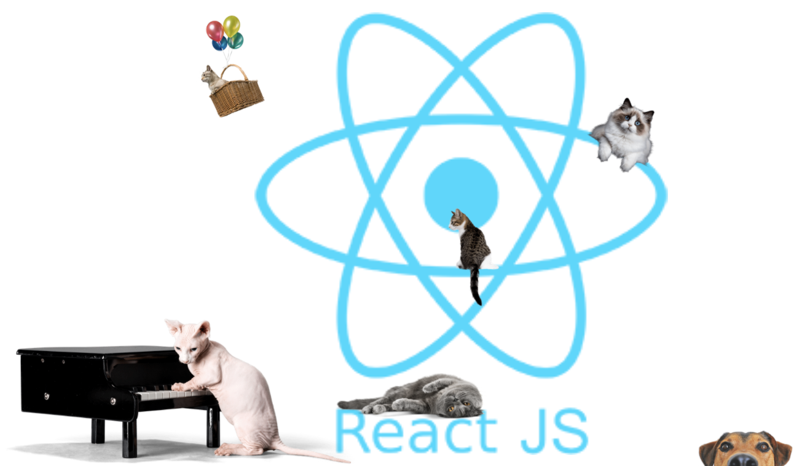

# React Props and State

Welcome to the wonderful world of React!

We'll be investigating components, props and state. Let's get started 🙌

## How to Get Started

Fork this repo to your Github and then clone the forked version of this repo

To install the dependencies run:

### `npm install`

or if use yarn:

### `yarn install`

(They both do the same thing)

Make sure you're in the right directory!

To start the app:

### `npm start`

or if you use yarn:

### `yarn start`

Runs the app in the development mode.

The app should open in your browser.

If the page doesn't open automatically, you can open [http://localhost:3000](http://localhost:3000) to view it in the browser.

The page will reload if you make edits 👍

You will also see any lint errors in the console ✅

You'll see there's a (very) basic React app already created for you. Have an explore of the files and get a sense of what it's doing. We're going to be adding features to make it more interactive.

Meow, lets get started!

Head over to [Activity 1](./activities/activity_1.md) to begin!
