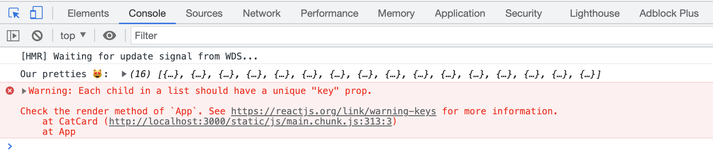

# Activity 8 - Level Up

Alright, so you've done it!

You've got a sweet little React app that loops through some cat data producing a gorgeous set of kitty cat cards. And you're using props to pass data between our components and have even used JavaScript to count our cats!

Bravo, bravo

There are just a few things we could do to make our app _even better_ 🔥

# Step 1 - Destructuring FTW!

In `cat_card.tsx` and other parts of our app, we are accessing nested props like this `props.name`.

This works fine, but it doesn't look very purrdy! 😸

Using our knowledge of the [Destructuring Assignment](https://medium.com/@lcriswell/destructuring-props-in-react-b1c295005ce0) in JavaScript, can you refactor the code to make it look a little neater?

Have a go then...

<details>
<summary>Click here to see the answer!</summary>
<pre>

```JavaScript
const CatCard : React.FC<CatCardProps> = (props) => {

    const { name, photoUrl, altText, species, favFoods, birthYear, catIndex } = props;

    return (
        <div className="card">
            <h3 className="card__text card__header">{name}</h3>
            </img>
            <p className="card__text">Species: {species}</p>
            <p className="card__text">Favourite Food(s): {favFoods}</p>
            <p className="card__text">Birth Year: {birthYear}</p>
			{props.catIndex < images.length && (
				<CatImage
					image={images[props.catIndex].image}
					altText={images[props.catIndex].altText}
					licenceType={images[props.catIndex].licenceType}
					licenceUrl={images[props.catIndex].licenceUrl}
					attributionName={images[props.catIndex].attributionName}
					attributionUrl={images[props.catIndex].attributionUrl}
				/>
			)}
        </div>
    )
}

export default CatCard;
```

Let's break it down. 🔨

Whereas before we were using object dot notation to drill into each piece of data we wanted to access from our cat object, we now use JavaScript destructuring assignment to extract the data we need and assign it to `props`

We can then use these extracted pieces of data as variables throughout our code, without needing to add the extra `.props` object dot notation

This makes our code look cleaner. If this file was huge, or if we had deeply nested properties it would also result in less repetition. Sweet!

</pre>
</details>

Booya!

We could take this one step further by doing the destructuring directly in our Header components parameters, by changing this one line like so:

<details>
<summary>Click here to see the answer!</summary>
<pre>

```JavaScript
// const CatCard : React.FC<CatCardProps> = (props) => {
const CatCard : React.FC<CatCardProps> = ({ name, photoUrl, altText, species, favFoods, birthYear }) => {

```

</pre>
</details>

Can you update `header.tsx` to use destructuring in this way too?

# Step 2 - Console Errors

You may have noticed when checking the console.logs() in your browser window that a little error message has snuck in.

It may have looked something like this:



This is a very common React warning and all React is trying to say is,

    "Hi there developer friend,

    I am very clever. But I struggle a bit when it comes to keeping track of lots of different data (like the number of cats you've just looped over, you cat-obsessed maniac).

    If these cat cards get added to or deleted, I'm going to lose track. Please give each cat card a unique key so I can keep track of who's coming and going.

    Cheers".

Sure is polite, for a robot. 🤖

## What is a Key in React? 🔑

A Key in React is a unique string which React uses to keep track of multiple otherwise-identical components (e.g. which User is which in a long list of Users.)

## How do we make a key?

You can use the unique key provided on data you get from a database. But sometimes our data won't have a unique key (like our cat data) so we need to make one to help React out.

There are lots of different ways to do this. We'll look first at a serious way to do it, then a lazy way, and then assess the pros and cons of each.

## Making a key - the non-lazy way!

There's a handy `npm` package [uuid](https://www.npmjs.com/package/uuid) called UUID which generates new unique IDs on command.

If our data is lacking a unique key, we can add it using this package.

## Using UUID - Step 1

-   In your terminal (make sure you're in the right directory) run:

`npm install uuid`

## Using UUID - Step 2

At the top of `App.tsx` import our unique identifier, like so:

`import { v4 as uuidv4 } from 'uuid';`

## Using UUID - Step 3

In `App.tsx`, move the array of cats out of the default parameters we're sending to `useState` and outside of the `App` component.

This is so we can edit the array contents before we add it to `useState`. And we have to move it outside of the App component because otherwise this will re-run _every time the App renders_ which makes the unique ID pointless - it's supposed to be attached to each cat!

The code will look something like this:

```JavaScript
// somewhere outside of your App component - this could be another file, like /data/catData.ts, or it could just be an array
// outside of the App component definition in App.tsx
const catData = [ /* big long array of cats here */];

// somewhere inside your App component
const [ cats, setCats ] = useState<Array<Cat>>(catData);
```

## Using UUID - Step 4

Now, BEFORE we pass `catData` as a parameter to useState, loop over the array of cats and add a new `id` property by calling `uuidv4()` - a function from UUID which returns a new ID. We only want this to happen once when the program runs so this code should also be outside of the App component.

If you've moved your catData into a separate catData.ts file then that's perfect - you can alter the array before you export it, like so:

```JavaScript
// catData.ts
const catData : Array<Cat> = [ /* big long array of cats here */];
catData.forEach(cat => cat.id = uuidv4());
console.log(catData); // each cat should now have a unique ID
export default catData;
```

Now when you import that catData in App.tsx it will already have unique IDs for each cat, that won't change during the lifetime of the program!

## Using UUID - Step 5

Use this new `id` property as key for our map over the `<CatCard />` component:

```JavaScript
<CatCard key={cat.id} name={cat.name} species={cat.species} favFoods={cat.favFoods} birthYear={cat.birthYear} photoUrl={cat.photoUrl} altText={cat.altText} />
```

## Using UUID - Save your file and Check your Browser Console

Poof!


Like a cat in the night, our error warning has disappeared.

## WAIT! Could this help us with our image problem?

You might have realised that having a unique key that corresponds to each cat would be a much better way to find the corresponding image than our previous system of mapping over the index of a different array. After all, what if those arrays got out of order - we'd end up displaying the wrong pictures for each cat if the arrays were out of sync 😱

One idea could be that in `App.tsx` we could set the same ID to an image when we set it for a cat, so they're linked in data - then when we map over the `cats` array we could `find` the image with a matching id.

This isn't full code and you don't have to add it to your project but perhaps we could imagine a solution that looks something like this:

```JavaScript
// App.tsx
const cats = [/* cat array */];
const images = [/* image array */];

cats.forEach((cat, index) => {
	const id = uuidv4();
	cat.id = id;
	images[index].id = id;
});

// later...
{ cats.map((cat, index) => <CatCard key={index} image={images.find(image => image.id === cat.id)} />)}
```

Perhaps you can see some problems with this solution too..! It's certainly still a bit messy, although it is nice to have a data `id` that links a cat together with its corresponding image.

## React Keys - the Lazy Way!

Forget images for a moment. There is a lazier way to solve the original issue where React complains about our `map` lacking a key. Let's remind ourselves of the problem:

```JavaScript
 { cats.map(cat => <CatCard />)}
```

Our cat cards need a unique id to keep track of. We'd like this id not to change during the lifetime of the program.

But in our case we happen to know that our cat array isn't going to change. So we could just use the index of each cat in the array as an id. (So the first cat will be cat id '0', the second cat will be '1', and so on.)

And we get the index automatically as the second parameter from map:

```JavaScript
 { cats.map((cat, index) => <CatCard key={index} />)}
```

So... this works. And is a common way for developers to pass keys in when mapping over an array. BUT! You have to _know_ that your array isn't going to change. If the array is constantly changing then cat with id 3 might suddenly be cat with id 2, and that may lead to subtle bugs.

The preferred way to solve this is for all your arrays to have proper permanent ids - ideally set by the backend. But sometimes using the array index is acceptable - you just have to understand the tradeoffs and choose for yourself.

## Nearly There!

Let's see if we can push this just a little further with some extension activities: [Activity 9 - Extension](./activity-9-extension.md)
