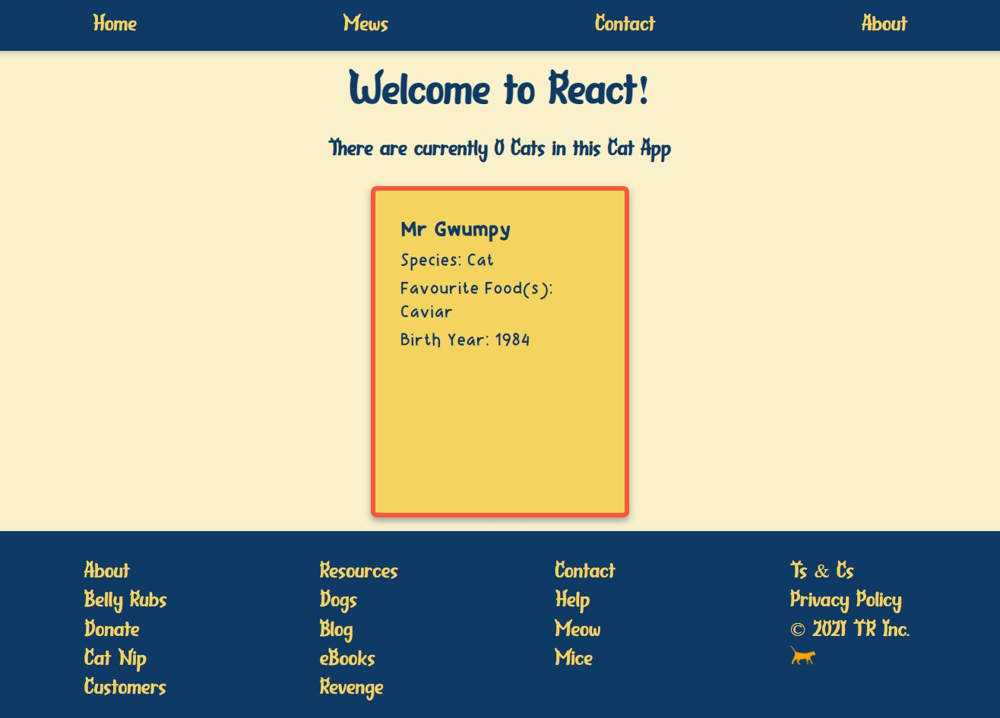

# Activity 3 - Render a Cat Card

Ok! So!

We've created some cat data "state" for React to watch.

We've created an all seeing, all powerful cat card (well, soon to be!)

Now before we hook these two up to each other, let's render our cat card on the screen.

## Step 1

In App's return statement, replace the ` {/* And here! */}` comment with your cat card.

Click here to see the answer

<pre>

`<CatCard />`

</pre>

Your app should now look something like this:

Click here to see the result

<pre>

</pre>

## Step 2

Ok so we've got one kitty's details showing, but that's not much good. We want to show _all_ the cats from our cat data on the screen in all their cat glory!

How do we do that? 🤔

Well, our cat data is in an Array, right?

And we know if we want to access each item in an array we can use some kind of....

Click here to see the answer

<pre>

For loop. Or, in modern JavaScript, we prefer an array method such as `map`

Just like we'd loop through a normal array, lets loop through our Cat data! It's just an array of objects after all 😺 ↬

</pre>

See [Activity 4](./activity_4.md) to find out more!
