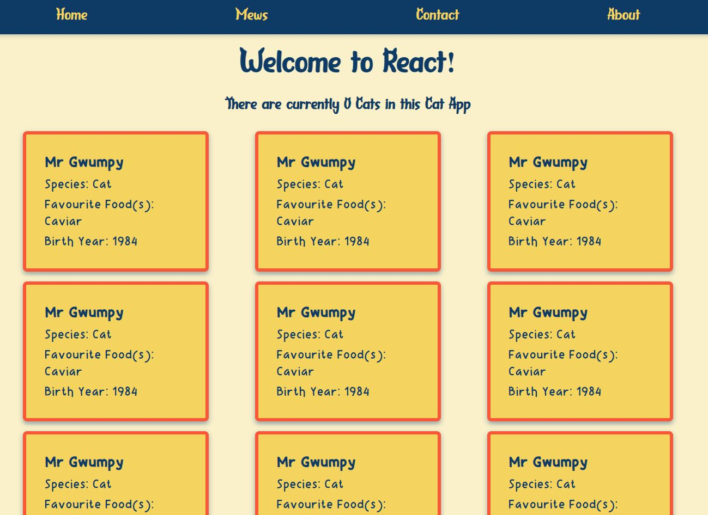

# Activity 4 - Loop de loop!

In `App.tsx` create a loop to render your `<CatCard/>` with

Hint: To insert JavaScript into our HTML or 'JSX' you'll need to write your JavaScript code inside a pair of curly braces { }.

<details>
<summary>Click here to see the answer</summary>
<pre>

```
    {cats.map(cat => <CatCard /> )}
```

Ok let's break it down. 🔨

We first told React we were going to insert some JavaScript into our `App.tsx` return statement by writing a pair of curly bois (braces)

We took our cat data and used the `.map()` method to loop through our cat objects

For every cat object in our cat data array, we return a `<CatCard />`

Neat 👍

</pre>
</details>

Your App should look something like this:

<details>
<summary>Click here to see the result</summary>
<pre>



</pre>
</details>

P.s. don't forget to delete your original `<CatCard />` line from `App.tsx` if you haven't already!

Time to jive in [Activity 5](./activity_5.md) 💃🕺
